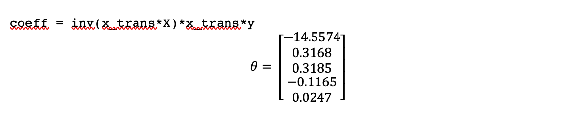
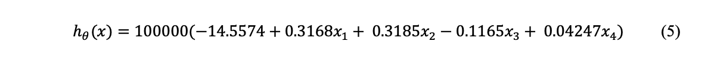
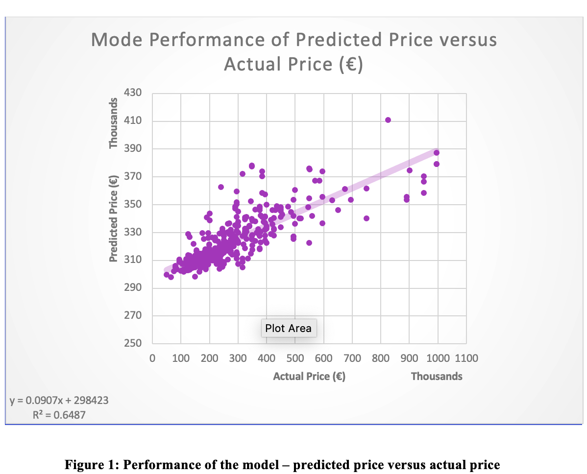

#  **Predicting House Prices in Ireland Using Multivariate Least Squared Linear Regression**

By James O&#39;Connor - Linear Algebra 

_IT Sligo_

## Introduction

Regression is a study of dependence (Weisburg, 2005). The goal of this project is to study the dependence of a number of properties on house prices in Ireland to create a linear regression model that can accurately predict the price of a house based on these properties. This model, if accurate, can have a number of applications:; it could be used to determine the approximate price of a house new to market, to figure out if the price of a house is correctly placed on the market (or the flipside to determine if it is good or bad value on the market), or to predict the movement of house prices over time.

This study involves developing a multivariate linear regression (MLR) model, using input data gathered from a renowned property website in Ireland (Daft, 2020) and using the normal equation to determine the model coefficients. The model was then analysed using a subset of previously unseen data to determine the accuracy of the model using the r squared value.

## Definitions

Simple Llinear regression is the attempt to model the relationship between two variables by fitting a linear equation to observed data ( (Yale, 1997). Multivariate linear regression is an extension of this to where two or more explanatory variables are used and a hyperplane is used to represent the best fit rather than a line.

Least squared linear regression is a common method used to fit the regression line or hyperplane to a dataset. It works by minimizing the sum of the squares of the vertical deviations from each data point to the line or hyperplane (Yale, 1997).

## Literature Review

Linear regression has been recorded to have been used since the early 19th century. It is widely applicable to a number of fields. (Niu, 2013) looked at determining the effect of house properties as variables using a linear regression model to predict the price of a house in San Francisco. These included sale months, interior size, lot size, built year, number of bedrooms, number of bathrooms, school proximity and median price of the city. The results of this study showed that the median city price, interior size had a much larger correlation to the response variable than house properties like bedrooms, bathrooms and build year. (C. R. Madhuri, 2019) compared multivariate linear regression to a number of regression techniques like ridge, LASSO, elastic net and gradient boosting regression and determined that a. Although it was the least complex technique, it was an adequate but not the most accurate method for house price prediction.

Selecting the correct number of variables to be included in the model is a critical step in finding the most optimal solution for a linear regression model. LessFewer variables means lessfewer degrees of freedom in the model and in theory should make our model more precise. However, this may not tell us the full story, and too few variables and it may not be sufficient to explain the predictive relationships (Yuan, et al., 2007). A common approach to determining the variables to include or exclude is to use a coefficient matrix, which shows the effect of each explanatory variable to the response variable separately.

The use of the normal equation in this paper was inspired by the work of Pprofessor Andrew Ng machine learning training course (Ng, 2014) and from (Brown, 2009). Both of these sources highlight the benefits and limitations of using the normal equation to calculate the coefficients of the model equation. The benefits include not having to scale features for the normal equation as well as its speed. These benefits break down with a large amountnumber of input data or a large number of features, and an more iterative approach e.g. gradient descent is suggested as a more computationally efficient approach.

##  Model Design

In designing the model, the equation of a line Our model will take more than one input parameter therefore the line equation needs to be modified to allow for more than one explanatory variable.

in matrix form this would be:

or more simply:

where the x values correlate to our vectorized input variables and the values correspond to the coefficient of each of these input variables, for input variables. is our output of our model, the price of a house for a given set of input variables. As the model is linear each x value is of the first order.

The dataset for the model was gathered using a popular website in Ireland on the 19th November 2020. This is an important distinction due to the time-dependant nature of property prices. Below is a sample of the dataset (m=6), which we will use for demonstration in this section.

| **districtarea** | **county** | **longitude** | **latitude** | **price** | **bathrooms** | **beds** | **ber\_classification** | **property\_type** | **surface\_area** |
| --- | --- | --- | --- | --- | --- | --- | --- | --- | --- |
| Courtown | Wexford | -6.237561 | 52.646088 | 149000 | 1 | 2 | G | semi-detached | 68.63 |
| New Ross | Wexford | -6.935998 | 52.404472 | 192000 | 2 | 4 | C3 | semi-detached | 105 |
| New Ross | Wexford | -6.944524 | 52.392443 | 65000 | 1 | 2 | G | end-of-terrace | 45 |
| Wexford Town | Wexford | -6.454622 | 52.332995 | 130000 | 1 | 2 | F | terraced | 60.73 |
| Campile | Wexford | -6.946246 | 52.331056 | 299950 | 2 | 4 | D1 | detached | 160.3 |
| Enniscorthy | Wexford | -6.793841 | 52.519084 | 375000 | 2 | 3 | E2 | detached | 170 |

**Table 1: A sample of larger dataset of houses for sale in Wexford on 19**** th **** November 2020**

There are a number of categorical, discrete and continuous variables in the dataset. Categorical variables can be used as input variables to solve linear regression problems by adding a new vector for each category, however, for simplicity the categorical variables (districtarea, , county, ber\_classification and property\_type) were removed from the dataset.

 | **longitude** | **latitude** | **bathrooms** | **beds** | **surface\_area** | **price** |
| --- | --- | --- | --- | --- | --- | 
 | -6.237561 | 52.646088 | 1 | 2 | 68.63 | **149000** |
 | -6.935998 | 52.404472 | 2 | 4 | 105 | **192000** |
 | -6.944524 | 52.392443 | 1 | 2 | 45 | **65000** |
 | -6.454622 | 52.332995 | 1 | 2 | 60.73 | **130000** |
 | -6.946246 | 52.331056 | 2 | 4 | 160.3 | **299950** |
 | -6.793841 | 52.519084 | 2 | 3 | 170 | **375000** |

**Table 2: Reduced features from Figure 1**

where equals the sample number and equals the feature number.

The next step is to consider the coefficients of each of these input variables, as defined in Eequation 1. These coefficients determine the degree to which each input vector affects our model output. As this is a minimization problem, i.e. we are trying to find the coefficients that minimise our mean-squared error, the squared distance each point is away from the plane. We can solve for these coefficients using the normal equation, as outlined by (Brown, 2009). The normal equation is obtained by setting the partial derivatives of the sum of square errors to zero (Springer, 2008). However, in order to use the normal equation effectively, each variable needs to be linearly independent. From studying the data, the bathrooms and beds are not completely independent i.e. number of bathrooms increases with number of beds. These variables were added together to create a single vector called bed\_bath in order to ensure linear independence and reduce the complexity and dimensionality of the model. The surface area vector is less affected by this relationship. Our dataset now becomes:

 | **longitude** | **latitude** | **bed\_bath** | **surface\_area** | **price** |
 | --- | --- | --- | --- | --- |
 | -6.237561 | 52.646088 | 3 | 68.63 | **149000** |
 | -6.935998 | 52.404472 | 6 | 105 | **192000** |
 | -6.944524 | 52.392443 | 3 | 45 | **65000** |
 | -6.454622 | 52.332995 | 3 | 60.73 | **130000** |
 | -6.946246 | 52.331056 | 6 | 160.3 | **299950** |
 | -6.793841 | 52.519084 | 5 | 170 | **375000** |

**Table 3: Dataset adjusted to use normal equation**

Note the addition of an additional unit vector for the zero coefficient to allow us to use matrices matrix multiplication. Now that the input vectors and samples have been defined, the normal equation can be used to determine the coefficients of the model. The normal equation is defined, in matrix form as follows:

where is our coefficients matrix, X is our input matrix and y (or is our output matrix. As this computation would be quite involved, MATLAB was used to compute the coefficients matrix.X = y =

where X is a 6 x 5 matrix and y is a 6 x 1 matrix. The y values have been scaled down by a factor of 10^5 in order to make our coefficients more manageable. The results will be scaled back up using a multiplier in the model. Multiplying out the normal equation using these values yielded the following coefficient matrix:

Putting these coefficients back into Equation (1) with our scaling multiplier we have our model equation:

# Results and Discussion

Using our model, and another subset of unseen data, we can predict the accuracy of our model, by filling in our input vectors with new values and measuring the result. These results can then be compared to the actual price as per the website. Here is a subset of 7 unseen samples with their model prediction.

| **longitude** | **latitude** | **bed\_bath** | **surface\_area (m^2)** | **Price (€)** | **model\_predicted\_price (€)** |
| --- | --- | --- | --- | --- | --- |
| -6.649044 | 52.382268 | 4 | 48 | **149,000.00** | **298,463.35** |
| -6.240034 | 52.711148 | 9 | 236 | **385,000.00** | **341,317.58** |
| -6.946246 | 52.331056 | 6 | 162.6 | **299,950.00** | **323,294.91** |
| -6.232659 | 52.637059 | 6 | 123 | **155,000.00** | **316,748.97** |
| -6.493459 | 52.685101 | 8 | 232.2 | **425,000.00** | **340,678.17** |
| -6.2349776 | 52.6467662 | 7 | 200 | **399,000.00** | **334,606.54** |
| -6.84286 | 52.284226 | 6 | 115 | **137,500.00** | **311,716.08** |

**Table 4: Performance of the model – predicted price versus actual price**

Evidently, the model did not perform well. However, as the model was working from a limited input dataset (m=6), this result is to be expected. Using the squared error of the distance between the predicted and actual price, the accuracy of each prediction was calculated.. Below is a plot of the entire dataset of 569 values, plotted with a regression trendline. As it is not possible to graphically represent this model in Euclidian space due to the number of input features, the figure below was used. It predicts the performance of the model versus the actual response variable from our input data for each point.

For a perfect prediction, the slope of the regression line in Figure 1 would be 1 and the intercept would be zero; indicating that our data input x would yield a perfect prediction yFrom these results an R squared value of 0.6487 was recorded. In other words: . While this is not a realistic target, it bounds our optimal solution. Examining the regression line for the predicted price versus actual price we can see that the slope is 0.0907 with an intercept of 298423. The R squared value indicates how closely the data is fitted to the regression line. In this model, a value of 1 would mean perfect prediction for each sample i.e. each input vector perfectly influenced our model to come up with the correct price. While this is not a realistic target, it bounds our optimal solution. This r squared value indicates that the majority of input data had a correlatory effect on the price of the house. The y intercept lies at €298,423, highlighting an inaccuracy in the model. This is the price that the model would predict at a house price of €0.00.

The resulting predictions demonstrate low accuracy most likely as a result of the small sample size.

# Future Research

- Limited data used for demonstrative purposes – get more data
- Use more data to consider not only the physical properties of the house but also data about the surrounding area
- Use other methods can be used to calculate the coefficients like gradient descent.
- Using other regression techniques e.g. ridge regression, LASSO regression and compare results
- Categorical variables could be used as well as other geospatial data like proximity to schools and urban centres

# Conclusion

To conclude, the use of linear regression has been demonstrated to be applicable to the prediction of housing prices based on properties of the house. The goal of this report was to discuss the process of creating a linear regression model using the normal equation to predict house prices based on a number of key features. The focus here was on the process more than the accuracy of the model. The limitations of the study have been outlined in the future research section, leaving much more room for improvement in a number of areas. Ultimately the price of a house is multi-faceted and more data should be included and considered when creating models.

# Works Cited

Brown, S. H., 2009. Multiple Linear Regression Analysis: A Matrix Approach with MATLAB. _Alabama Journal of Mathematics,_ Volume Spring/Fall.

C. R. Madhuri, G. A. a. M. V. P., 2019. _House Price Prediction Using Regression Techniques: A Comparative Study._ Chennai, IEEE.

Daft, 2020. _Daft.ie._ [Online]
 Available at: www.daft.ie/wexford/houses-for-sale/
 [Accessed 19 November 2020].

Ng, A., 2014. _coursera.org._ [Online]
 Available at: https://www.coursera.org/learn/machine-learning/home/welcome
 [Accessed 1 June 2020].

Niu, S., 2013. _Predicting housing price,_ San Francisco: Stanford.

Springer, 2008. _Normal Equations. In: The Concise Encyclopedia of Statistics._ New York: Springer.

Weisburg, S., 2005. _Applied Linear Regression._ s.l.:Wiley.

Yale, 1997. _stat.yale.edu._ [Online]
 Available at: http://www.stat.yale.edu/Courses/1997-98/101/linreg.htm
 [Accessed 24 November 2020].

Yuan, M., Ekici, A., Lu, Z. &amp; Monteiro, R., 2007. Dimension reduction and coefficient estimation inmultivariate linear regression. _Royal Statistical Society,_ 69(3), pp. 329-346.
